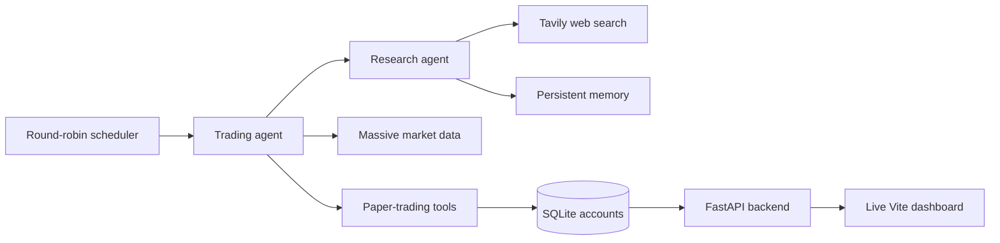

# Autonomous Traders

Autonomous Traders is a multi-agent paper-trading experiment where four AI investors independently research the market, maintain distinct strategies, and manage simulated $10,000 portfolios.

Each trader has a different investment personality, from patient value investing to aggressive macro and innovation-focused strategies. Their decisions, holdings, trades, and performance are displayed in a live dashboard, making it possible to compare how different approaches behave under the same market conditions.

> This project is for experimentation and education. It does not connect to a brokerage or execute real-money trades.

## The trading floor

| Agent | Style | Focus |
| --- | --- | --- |
| Warren | Patient value investor | Quality businesses, fundamentals, and long-term compounding |
| George | Aggressive macro trader | Economic dislocations, geopolitics, and contrarian opportunities |
| Ray | Systematic allocator | Diversification, economic cycles, and risk-balanced exposure |
| Cathie | Innovation investor | Disruptive technology and crypto-focused ETFs |

Every agent has its own portfolio, strategy, transaction history, and persistent research memory. Agents can research opportunities, inspect prices and balances, buy or sell shares, and revise their strategies as they learn from prior decisions.

## How it works

The scheduler runs one trader at a time, with a configurable delay between agents. This round-robin design reduces simultaneous model and market-data requests while giving every trader a regular turn. With the default 15-minute interval, each of the four agents runs approximately once per hour.

During a turn, an agent:

1. Reads its current strategy and portfolio.
2. Delegates market research to its research agent.
3. Checks available cash and verified market prices.
4. Decides whether to buy, sell, rebalance, or hold.
5. Records completed trades and activity in SQLite.

The application alternates each agent between finding new opportunities and reviewing its existing portfolio.

## Dashboard

The frontend provides a live view of:

- Portfolio value and profit or loss
- Current holdings and allocation
- Strategy summaries
- Recent transactions
- Agent and tool activity
- Performance history
- Market status

The dashboard is read-only. Trading occurs in the independent scheduler process, while FastAPI exposes the latest account state to the Vite frontend.

## Technology

- **Python and asyncio** for agent orchestration and scheduling
- **OpenAI Agents SDK** for model-driven workflows and tool use
- **Model Context Protocol (MCP)** for research, memory, market, and account tools
- **FastAPI** for the dashboard API
- **SQLite** for accounts, transactions, strategies, and activity logs
- **Vite, TypeScript, and uPlot** for the web dashboard
- **Tavily** for financial-news research
- **Massive** for stock prices and market status

